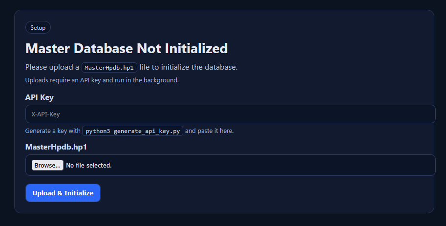
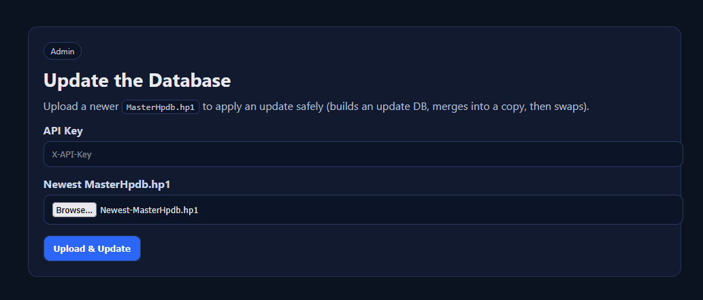

# HPDB API Server

See `QUICKSTART.md` for the fastest setup path.

This repo contains:

- A converter (`hpdb_to_sqlite.py`) that turns Uniden-style HomePatrol text exports into SQLite.
- A FastAPI server (`app.py`) that queries that SQLite DB by state/county or ZIP code.
- Admin endpoints to upload/initialize the DB and to safely apply updates.

## Screenshots

Initialization UI (`/initialize`):



Update UI (`/update`):



## Run the API

Recommended:

```bash
uvicorn app:app --host 0.0.0.0 --port 16444
```

Or:

```bash
python3 app.py
```

If `hpdb_default.sqlite` does not exist yet and you open the server in a browser, it will redirect `/` → `/initialize`
and provide a simple upload UI for initializing the database (API key + `MasterHpdb.hp1` upload).

There is also a browser update UI at `/update` (API key + `MasterHpdb.hp1` upload) which shows a small added/removed/changed
summary after the update completes.

### Environment variables

- `HPDB_PATH` (default: `./hpdb_default.sqlite`)
- `ZIP_CSV_PATH` (default: `./uszips.csv`)
- `UPLOAD_DIR` (default: `./uploads`)
- `API_KEYS_PATH` (default: `./keys.ini`)
- `HOST` / `PORT` (only used by `python3 app.py`)

## API keys

Updates are protected with an API key header:

- Header: `X-API-Key: <key>`
- Keys are stored in `keys.ini` (or `$API_KEYS_PATH`) under `[api_keys]`.

This repo ships with a default development key:

- `YOU-REALLY-GOTTA-CHANGE-THIS`

Generate a real key (this also removes the default key from `keys.ini`):

```bash
python3 generate_api_key.py --comment "CI deploy pipeline"
```

The script prints the new key to stdout. Save it somewhere safe.

If you run `python3 generate_api_key.py` without `--comment`, it will prompt you for the key’s purpose.

## Query endpoints

### `GET /hpdb/query`

Query by state + county (common use-case).

Example:

```bash
curl "http://localhost:16444/hpdb/query?state=MO&county=Jackson"
```

### `GET /hpdb/query/by-zip`

Query by ZIP code.

- If `radius_miles=0` (default), it maps ZIP → county/state and runs the county query.
- If `radius_miles>0`, it performs a true radius search using:
  - `site.lat/lon` for trunk sites
  - `c_group.lat/lon` for conventional “departments”

Example:

```bash
curl "http://localhost:16444/hpdb/query/by-zip?zip=64106&radius_miles=25"
```

Notes:
- Control channels are not explicitly marked in this dataset; the API returns **all** site frequencies for each trunk site.

### `GET /hpdb/counties`

List/search counties within a state:

```bash
curl "http://localhost:16444/hpdb/counties?state=MO&q=jac"
```

## Admin endpoints (uploads / updates)

### Status + jobs

- `GET /hpdb/admin/status`
- `GET /hpdb/admin/jobs/{job_id}`

### Initialize the DB (first-time upload)

If `hpdb_default.sqlite` does not exist, most query endpoints return `503` until you upload a master file.

Browser UI (recommended for first-time setup):

- Open `http://<host>:16444/` and you’ll be redirected to `/initialize`.
  - For updates later, open `http://<host>:16444/update`.

Upload `MasterHpdb.hp1`:

```bash
curl \\
  -H "X-API-Key: <your key here>" \\
  -F "file=@MasterHpdb.hp1" \\
  "http://localhost:16444/hpdb/admin/upload-master"
```

This starts a background job that builds a new SQLite DB and then atomically swaps it into `HPDB_PATH`.

### Update the DB (safe update workflow, API key required)

This endpoint **never** writes to the active DB directly.

Workflow:
1. Upload new `MasterHpdb.hp1`
2. Build a new `hpdb_update.sqlite`
3. Merge changes into a *copy* of the active DB (upsert semantics)
4. Atomically swap the merged DB into place

Call it like:

```bash
curl \\
  -H "X-API-Key: <your key here>" \\
  -F "file=@MasterHpdb.hp1" \\
  "http://localhost:16444/hpdb/admin/update-master"
```

Poll job status:

```bash
curl "http://localhost:16444/hpdb/admin/jobs/<job_id>"
```

## Building the SQLite DB manually

The converter defaults to a compact output (no lossless `records` table, and runs `VACUUM`):

```bash
python3 hpdb_to_sqlite.py --input . --out hpdb_default.sqlite --overwrite
```

If you want a full “lossless” DB for debugging:

```bash
python3 hpdb_to_sqlite.py --input . --out hpdb_default.sqlite --overwrite --lossless-records
```

## Validating updates

To validate that an update upload produced the same data as a fresh rebuild from a given `MasterHpdb.hp1`, use:

```bash
python3 validate_hpdb_update.py --active-db hpdb_default.sqlite --master Newest-MasterHpdb.hp1
```

To see what changed between two master snapshots (added/removed/changed keys per table):

```bash
python3 validate_hpdb_update.py --active-db hpdb_default.sqlite --baseline-master MasterHpdb.hp1 --master Newest-MasterHpdb.hp1
```

This rebuilds a temporary “expected” SQLite DB from the master file and compares stable-key tables.
It reports per-table counts plus:

- `missing`: keys present in expected but missing in active (should be 0 after a successful update)
- `extra`: keys present in active but not in expected (deletions not applied)
- `diff`: keys present in both but with differing non-key columns
